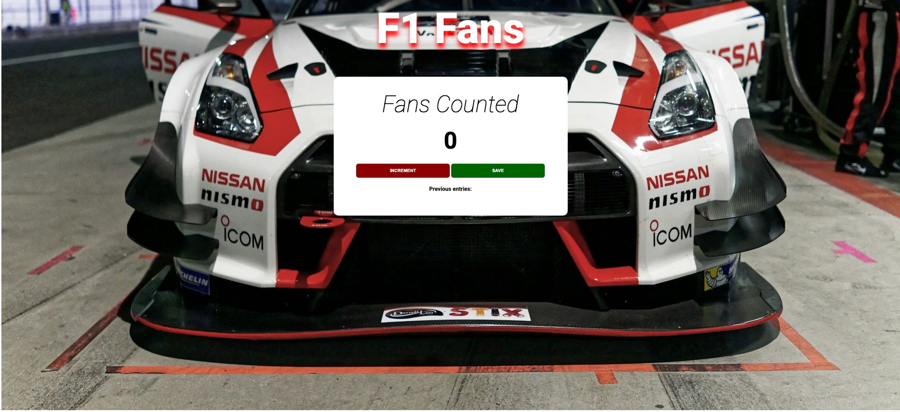

# F1 Fan Counter

  

A simple counter to track the number of F1 fans at events or gatherings.



## Table of Contents

- [Overview](#overview)
- [Features](#features)
- [Technologies Used](#technologies-used)
- [Installation](#installation)
- [Project Structure](#project-structure)
- [How to Use](#how-to-use)
- [Contribution](#contribution)
- [License](#license)

## Overview

This web application allows you to easily count the number of F1 fans and record previous counts. It features a simple user interface with an F1 theme and basic counting functionality.

The site is fully responsive, providing an optimized experience for desktops, tablets, and mobile devices.

## Features

- Incremental counter with dedicated button
- Functionality to save previous counts
- F1-themed UI with thematic background
- Responsive design

## Technologies Used

- HTML5 / CSS3
- JavaScript
- Vite (bundler)


## Demo

View the live demo [here](https://hometown.kevinngongang.dev/).

## Installation

```bash
# Clone the repository
git clone https://github.com/bakadja/passenger-counter-app.git
cd passenger-counter-app

# Install dependencies
npm install

# Start the development server
npm start

# Build for production
npm run build
```

## Project Structure

```
passenger-counter-app/
├── index.html       # Main HTML structure 
├── index.js         # Javascript counter logic
├── index.css        # Styles and layout
├── f1.jpg           # Background image
└── 
```

## How to Use

1. Click the "INCREMENT" button to count an additional fan
2. Use the "SAVE" button to record the current count and reset the counter
3. Previous counts are displayed at the bottom of the application


## Contribution

Contributions are welcome! To contribute:
1. Fork the project
2. Create a new branch (`git checkout -b feature/improvement`)
3. Commit your changes (`git commit -m 'Added a new feature'`)
4. Push to the branch (`git push origin feature/improvement`)
5. Open a Pull Request

## License

This project is licensed under the MIT License. See the [LICENSE](LICENSE) file for details.

---

